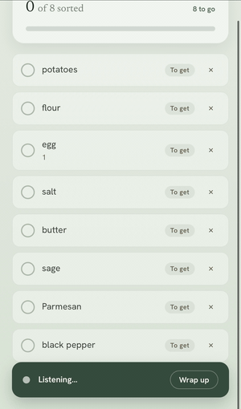
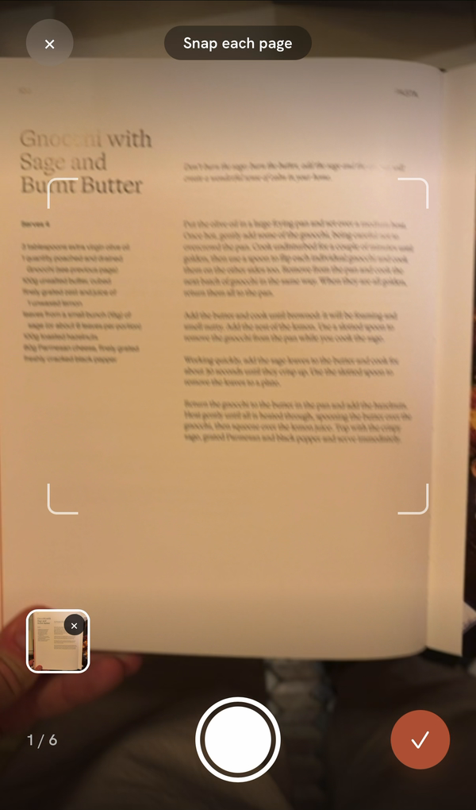
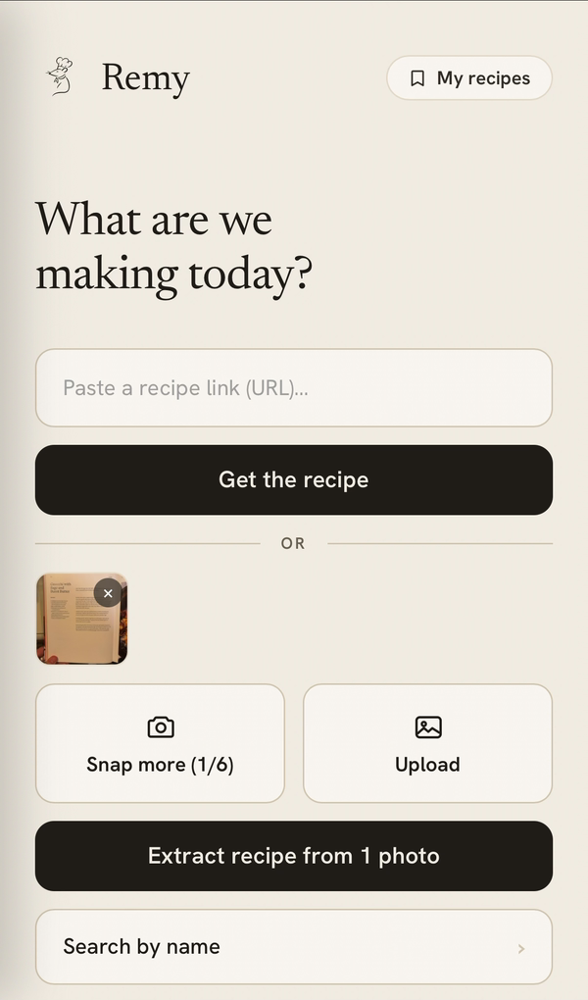
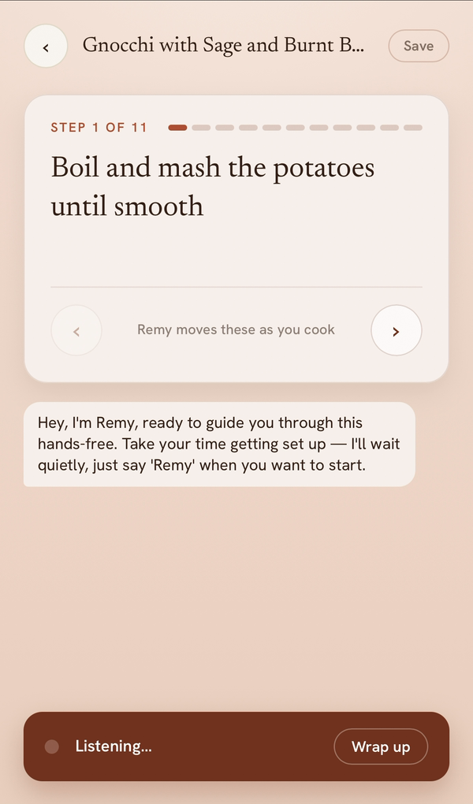
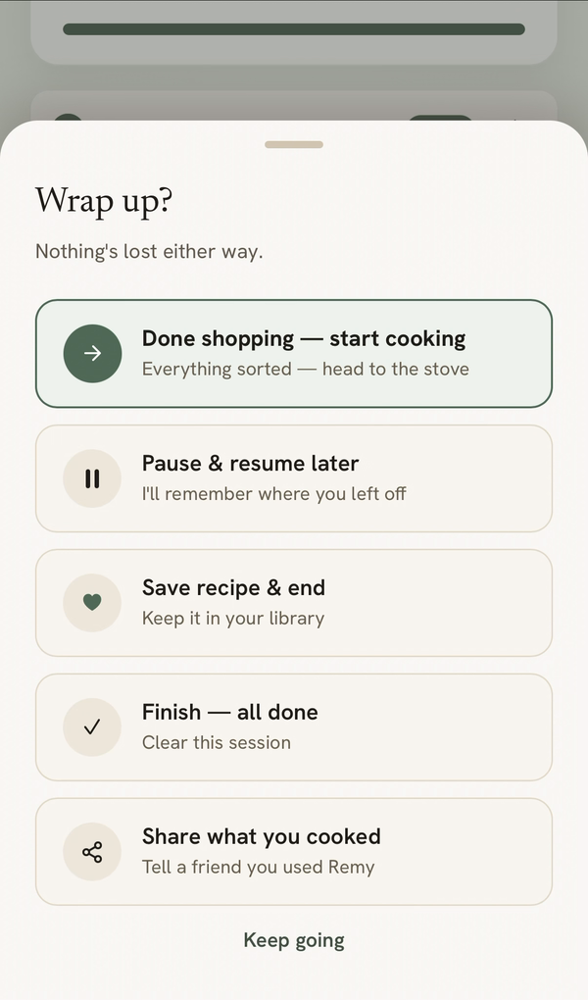

# Remy

Remy is a voice cooking assistant that reads a recipe aloud and tracks your
ingredients while your hands are busy.



<p>
  
  
</p>

<p>
  
  
</p>

Live at https://www.remythechef.com

## Why I built it

Cooking from a phone means washing your hands to scroll, or propping the screen
where it gets splattered. Recipe apps assume you are looking at them. I wanted
one that assumes you are not: the screen is for glancing, not tapping.

## How it works

React 19 and Vite, deployed on Vercel. The serverless functions in `api/` hold
every server-side key.

Recipe intake has three paths. A pasted URL is reduced to article text with
Readability and linkedom, then sent to Claude (`claude-haiku-4-5-20251001`)
with forced tool use so the response is always structured. Photographed pages
go to the same model through the vision API, six at a time. Search calls
the Spoonacular API and skips the model.

The voice session runs on ElevenLabs Agents. Four client-side tools read and
write React state directly: `get_shopping_list`, `confirm_ingredient`,
`get_next_step` and `log_observation`. Shopping renders a checklist the agent
updates as you talk. Cooking renders a step card you can also move by hand.

Accounts are optional. Guest recipes live in `localStorage`. Signing in points
the same storage layer at Supabase Postgres, protected by row-level security,
and claims on-device recipes on first sign-in.

## Status and limitations

Recipe intake, both voice modes, pause and resume and the saved library all
work. Accounts are verified against a real Supabase project.

Known gaps:

- The agent's prompt, voice and tools live in the ElevenLabs dashboard, not
  this repo; cloning alone will not give a working agent.
- The agent has no host allowlist.
- A bad extraction can be retried but not edited.
- Recipes from URLs and photos have no image; only Spoonacular supplies one.
- There is no dark mode.

## Running it

```bash
npm install
npx vercel dev
```

Use `vercel dev`, not `npm run dev`: plain Vite does not serve the `api/`
routes. The function runtime reads `.env`, not `.env.local`, so server keys go
in both.

```
VITE_ELEVENLABS_AGENT_ID=   # public
ANTHROPIC_API_KEY=          # server only
SPOONACULAR_API_KEY=        # server only
VITE_SUPABASE_URL=          # optional
VITE_SUPABASE_ANON_KEY=     # optional
```

Accounts also need `supabase/schema.sql` run in the Supabase SQL editor, which
creates the tables and their RLS policies.
